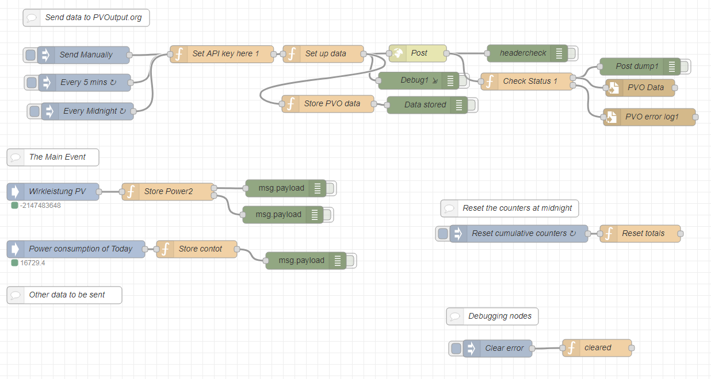

# Upload Data from ioBroker to Pvoutput

<br/>

This Flow can be used to upload Generation-Data of a PV Plant and Consumption-Data to the portal pvoutput.org.

It implements the API described here https://pvoutput.org/help.html#api

Using the ioBroker Node-RED integration Adapter, the Data is published via MQTT and this Flow receives the data by subscribing on the suitable Topic. 

## Usage

- Import the Flow in Node-RED
- Edit the API-Key:
```
'X-Pvoutput-Apikey': 'myApikeyHere'
```
- Edit the SystemId:
```
'X-Pvoutput-SystemId': 'mySystemIdHere'
```
- Edit topic to the current power of your PV Plant
```
"topic": "modbus.0.inputRegisters.30775_AC_Wirkleistung W"
```
- Edit the topuc to the total consumtion (in Wh) of today:
```
"topic": "javascript.0.Strom.Verbrauch.Today",
```